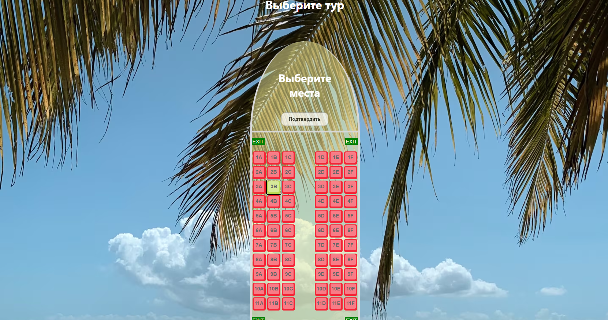

# Flight-booking-app

Interactive web application for selecting airplane seats and entering passenger data.

## Features
- Multi-step interactive booking flow
- Dynamic passenger form generation
- Interactive airplane seat selection system
- Input validation (name, ticket format)
- Real-time state collection
- SPA-like behavior without frameworks

## Development Tools

## Technologies

## Architecture
- Modular JavaScript (ES Modules)
- Component-based DOM rendering
- Step-based user flow (wizard-like structure)
- State stored in runtime memory

## Limitations
- No persistent storage (data resets on refresh)
- No backend integration
- Basic validation logic

## App Flow
1. Enter number of passengers
2. Fill passenger data forms
3. Select seats on airplane layout
4. Confirm booking

## Screenshots

### Passenger Count

### Passenger Details

### Seat Selection

## What I Learned
- Modular JavaScript structure
- Working with DOM dynamically
- Form handling and validation
- Event-driven architecture
- UI state management without frameworks
